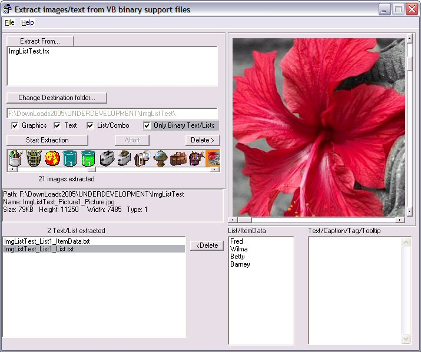

## Extract VB Binary data 4

### Description

VB Binary files are where VB stores any data added to a form/designer/usecontrol/property page in the IDE (either through wizards or the Property window). These are the .frx, .ctx, .dsx, .pax etc files that vb generates.

THe advantage is that you don't need to provide the original graphics, the disadvantage is that it can be hard to access/edit stored this way.

This program allows you to extract that data for easier manipulation.

----

WHATS NEW

----

This version can extract Text and List/Combo data as well as graphics. At present the data is just dumped to text files. To reincorperate it in your code you will have to added the necessary code.

----

WHAT'S FIXED

----

FIXED error in code meant that dsr(dsx) files were ignored.

IMPROVED Speed up in file scanning.

----

WHAT'S MISSING

----

Not yet able to extract TextRTF from RichTextBoxes. Any suggestions?
 
### More Info
 

             |
---                |---
**Submitted On**   |2005-02-14 20:39:02
**By**             |[Roger Gilchrist](https://github.com/Planet-Source-Code/PSCIndex/blob/master/ByAuthor/roger-gilchrist.md)
**Level**          |Intermediate
**User Rating**    |5.0 (25 globes from 5 users)
**Compatibility**  |VB 6\.0
**Category**       |[Complete Applications](https://github.com/Planet-Source-Code/PSCIndex/blob/master/ByCategory/complete-applications__1-27.md)
**World**          |[Visual Basic](https://github.com/Planet-Source-Code/PSCIndex/blob/master/ByWorld/visual-basic.md)
**Archive File**   |[Extract\_VB1852882142005\.zip](https://github.com/Planet-Source-Code/roger-gilchrist-extract-vb-binary-data-4__1-58907/archive/master.zip)

